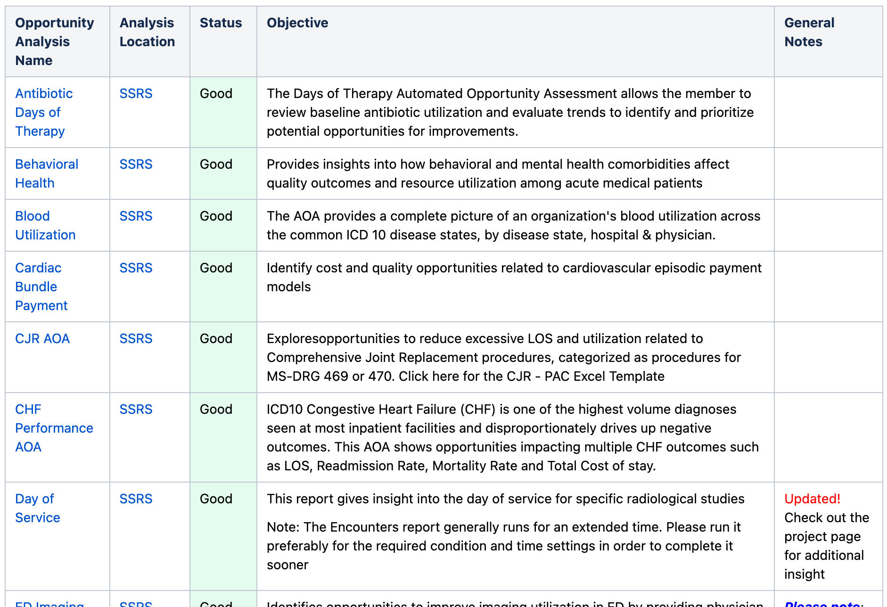
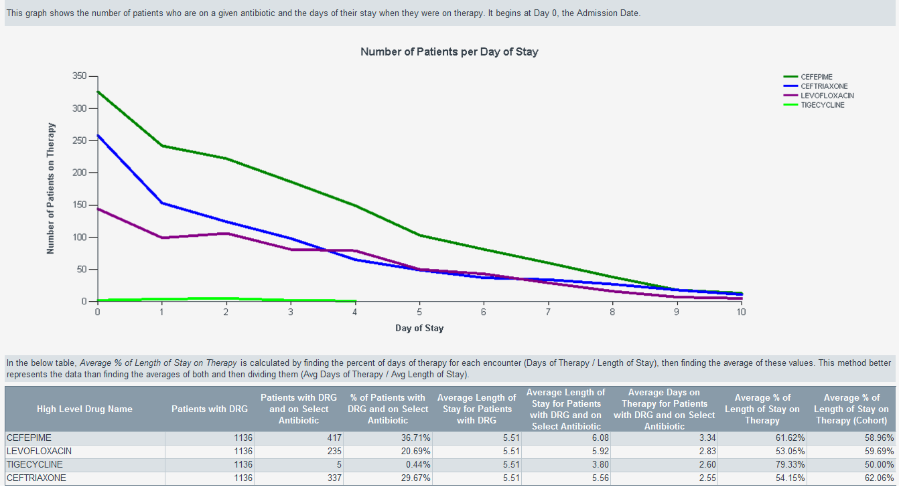
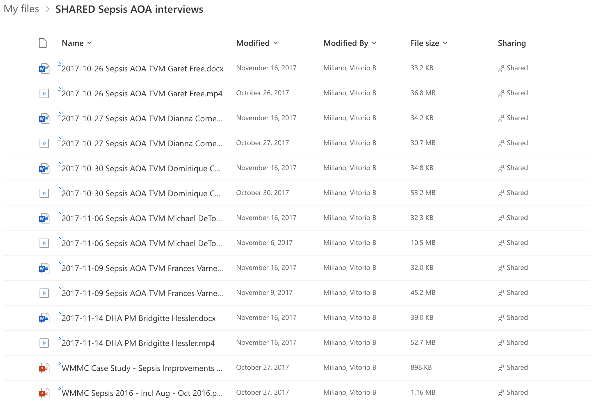
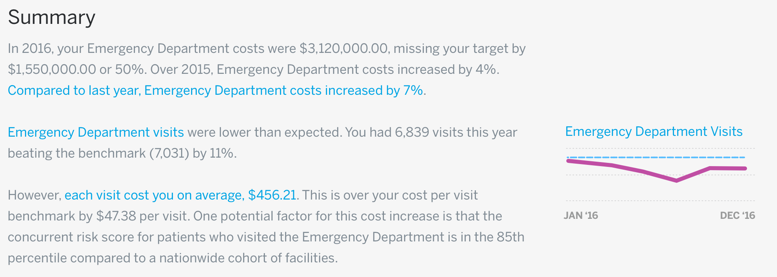
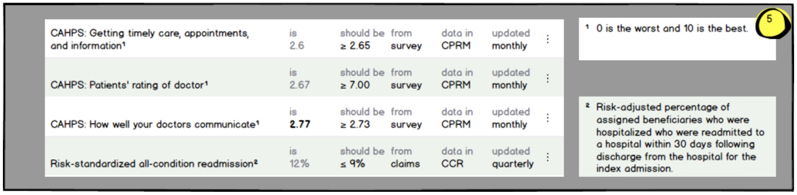
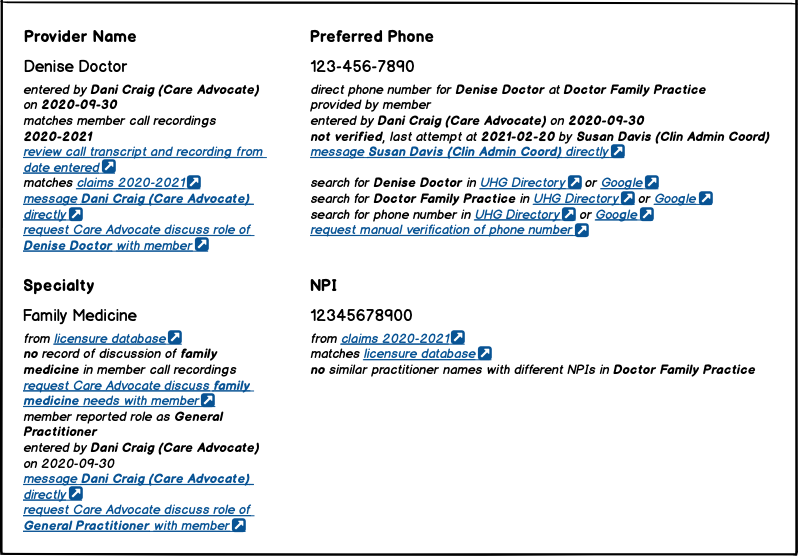
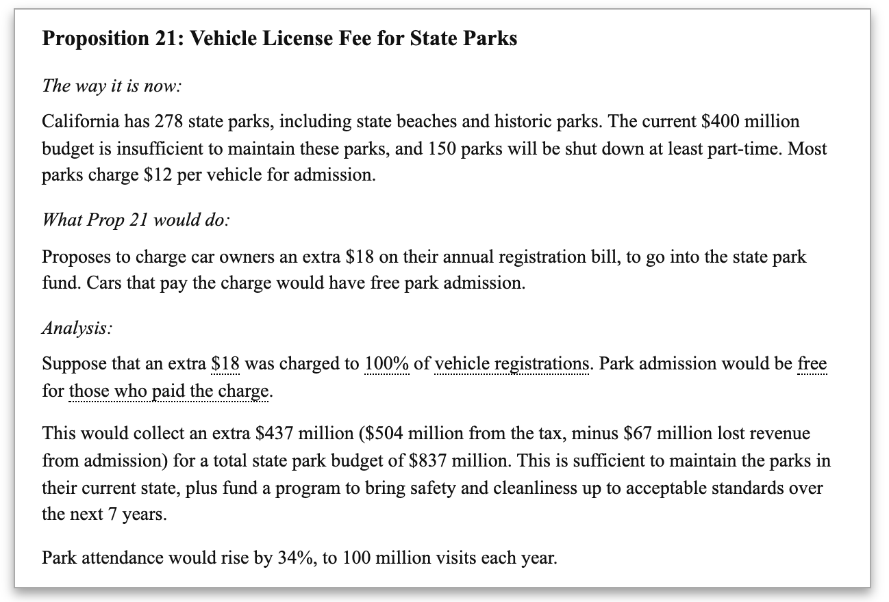
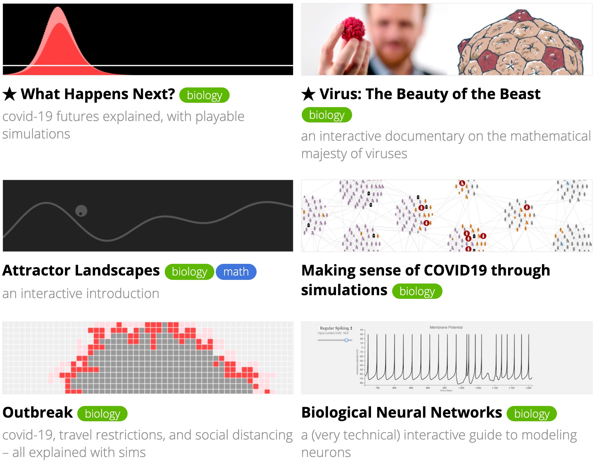

AI/ML with explainability/interpretability/transparency features are not widespread.  If we can't yet create such systems, we can still work towards them.  There are algorithms all around us, in every system we work on.  We call them heuristics, or expert systems, or decision trees, or if-then-else blocks.  They're just as opaque, and we can build expertise in explaining systems — and trust with designers, developers, and end-users — by starting with explaining non-AI/ML systems first.

<!--truncate-->

 

## Explaining AI/ML decisions

"Artificial intelligence" and machine learning systems (AI/ML) are often [black boxes](2021-03-24-black-box-glass-box.md): training data goes in, parameters are [adjusted by a graduate student](https://twitter.com/deliprao/status/1235697599975317504), input data goes in, something comes out.  Sometimes it's magical: a [bakery AI can also detect cancerous cells](https://www.newyorker.com/tech/annals-of-technology/the-pastry-ai-that-learned-to-fight-cancer); sometimes it's terrible: [every Black face looks the same](https://www.wired.com/story/best-algorithms-struggle-recognize-black-faces-equally/) to it.  But, why did it do that?

Explainability, interpretability, and transparency: these are facets of being able to understand and communicate what an AI/ML system is doing and why.  Definitions vary, but for this writing, we'll define them as:

<dl>
<dt>Explainable</dt>
<dd>The system can convey why</dd>
<dt>Interpretable</dt>
<dd>The user can determine how</dd>
<dt>Transparent</dt>
<dd>The provenance of the result can be traced all the way back to the training data</dd>
</dl>

These features are not widespread within commercial AI/ML contexts.  This means there's an opportunity: not only to differentiate, but also to de-risk the use of AI/ML systems in business.  Every AI/ML system that could have regulatory, legal, consumer, or academic contact, may one day be required to explain how it makes decisions.  We've already seen at least one instance of this, with [academic testing of Optum's Impact Pro system revealing racial bias](https://www.nbcnews.com/news/nbcblk/racial-bias-found-widely-used-health-care-algorithm-n1076436), and [a subsequent regulatory inquiry](https://www.wsj.com/articles/new-york-regulator-probes-unitedhealth-algorithm-for-racial-bias-11572087601).  Explainability, interpretability, and transparency are necessary requirements for proving [ethical behavior](https://optum.video.uhc.com/media/Ethics%20of%20AI%20and%20ML/1_8et8bldu).

:::note Share this!
Explainability, interpretability, and transparency features are an opportunity to de-risk the use of an AI/ML system.
:::

These features are ideally defined and structurally built into the systems from the beginning; adding them on later is still the subject of research.  Let's look at some references:

- _Cloudera Fast Forward Labs_ publishes applied research reports on machine learning topics, and has some of the most accessible reporting in this space, because they include live prototypes demonstrating the subject being discussed.  Their report on [Interpretability](https://ff06-2020.fastforwardlabs.com), originally from 2017, was made public in 2020.
- _The Gradient_ is a digital magazine founded by students and researchers at the Stanford Artificial Intelligence Laboratory.   Their essay, [Interpretability in Machine Learning: An Overview](https://thegradient.pub/interpretability-in-ml-a-broad-overview/), provides a broad, academic overview of interpretability, with plenty of inline references to other sources.
- _Distill_ is an online journal for web-native explanations of machine learning subjects, particularly those which include interactive diagrams, new notations, bespoke visualizations, and reproducible notebooks.  They have at least three relevant papers: [Feature Visualization](https://distill.pub/2017/feature-visualization/), on how neural networks build up their understanding of images, from 2017; [The Building Blocks of Interpretability](https://distill.pub/2018/building-blocks/), combining various interpretability techniques, from 2018; and [Visualizing Neural Networks with the Grand Tour](https://distill.pub/2020/grand-tour/), on using high-dimensional point clouds to see NN behavior, from 2020.
- Christoph Molnar is a statistician and machine learner who self-published a book titled [Interpretable Machine Learning](https://christophm.github.io/interpretable-ml-book/), now in a second edition, with over 2000 citations.  The book focuses on interpretability methods which can be applied to any machine learning model, and can be applied after the model has been trained.
- IBM Research donated "a comprehensive open source toolkit of diverse algorithms, code, guides, tutorials, and demos that support the interpretability and explainability of machine learning models" to the Linux Foundation AI & Data Foundation, called [AI Explainability 360](http://aix360.mybluemix.net/).

However, if we don't yet have the experience to design and build explainable, interpretable, and transparent systems, we can still contribute to the body of knowledge in this space.  How technical systems are explained to laypeople is a skill, irrespective of what's being explained.  There are algorithms all around us, in every system we work on.  We call them heuristics, or expert systems, or decision trees, or if-then-else blocks.  They're just as opaque, and we can build expertise in explaining systems — and trust with designers, developers, and end-users — by starting with explaining non-AI/ML systems first.  Let's look at some examples: one internal in production, a few internal prototypes, and one external.

:::note Takeaway
We can build expertise in explaining systems — and trust with designers, developers, and end-users — by starting with explaining non-AI/ML systems.
:::

## Automated opportunity assessments

Optum Analytics, as part of the CCC and Data Hub products, could produce automatically-generated, comprehensive reports for specific opportunities for clinical improvement, called _Automated Opportunity Assessments_.

These reports weren't just facts and figures.  They contained all the data and surrounding context a clinical leader needed, organized in a clinical manner, to make actionable decisions.  AOAs took the opaque data tables from the source data and from the CCC and Data Hub applications, and explained them.

The catch was, for business reasons more than anything else, these explanations had to be generated by Optum staff, only by request.  They weren't available in the applications themselves.

There were some two dozen AOAs available, all with detailed explanations and clinically relevant analyses.  In 2017, as part of an alternative product analysis for a care variation analytics initiative, Caitlin Hawkins (now with UHG R&D) and I documented examples of AOA output and clinical presentation:

I've shared these examples of the "Improving Sepsis Outcomes" AOA in [a personal OneDrive folder](https://vitorio.goto.optum.com/sepsis_aoa).  These examples are in the form of recordings and transcripts, which include data analyst presentations of the AOA report as they'd deliver it to a clinical stakeholder, so you can see how different it is from the traditional static dashboards we often provide.  There are also two examples of additional deliverables based on the AOA output.  Specific metrics and background for each AOA is available in both the [Humedica/Advisory Confluence](https://wiki.advisory.com/display/CPM/Analytics%3A+CCC) and the [Optum Confluence](https://confluence.optum.com/display/CPM/Analytics%3A+CCC).

Taking what an analyst would explain live, and integrating that explanation into reports, is a powerful first step in helping users understand the data they're presented with.  As ease-of-use improves and software gets pushed down to less skilled users, it can also make the data more actionable.

:::note Takeaway
Taking what an analyst would explain live, and integrating that explanation into reports, is a powerful first step in helping users understand the data they're presented with.
:::

## Narrative user interface prototypes

Many products have experimented with narrative user interfaces, especially those which need to emphasize data lineage or data provenance in order to get clinical users to trust the data.  Here's one example from the "Edison" prototype for the Population Health Analytics product, circa 2017:

Here's another example from an untitled scorecard builder product targeted at chief medical officers, circa 2013:

Here's a third example from Enlighten, to provide provably accurate contact information for a provider on a care team, circa 2021:

In each case, notice how supporting information and context is provided in clear detail, directly in the user interface, to support explainability, interpretability, and transparency of the data.  Data lineage or data provenance can be a first step toward exposing context in the end-user UI.

:::note Takeaway
Data lineage or data provenance can be a first step toward exposing context in the end-user UI.
:::

## Explorable explanations

A step beyond a narrative user interface is an interactive narrative _in_ the user interface.  There are a couple of different variations of this: _reactive documents_ and _explorable explanations_, with the former having particular application for business intelligence tools, and the latter gaining more popular traction.  Both are relevant for our discussion.

"Reactive documents" allow users to experiment with the assumptions and figures in the interface, to see the consequences of changing one variable or another.  [This early example from 2011](http://worrydream.com/ExplorableExplanations/#parkExample) allows you to play with the analysis of the impact of funding California state parks with a vehicle registration surcharge.  You can click or click-and-drag on the text of the charge, the percentage paying the fee, park admission cost, and park attendee type.  Changing one value reflects a change in the analysis and outcome content itself.  As the rest of the page explains:

> There's nothing new about scenario modeling. The authors of this proposition surely had an Excel spreadsheet which answered the same questions. But a spreadsheet is not an _explanation_. It is merely a dataset and model; it cannot be _read_. An explanation requires an **author**, to interpret the results of the model, and present them to the reader via language and graphics.

By becoming better versed in authoring explanations for non-AI/ML systems, which necessarily cuts across many of the silos that currently compartmentalize our data and our work, we can both prepare ourselves for authoring explanations for and within AI/ML systems, and also expose and surmount the organizational and technical constraints which would prevent us from doing so immediately today.

:::note Takeaway
By becoming better versed in authoring explanations for non-AI/ML systems, we can both prepare ourselves for authoring explanations for and within AI/ML systems, and also expose and surmount organizational and technical constraints.
:::

"Explorable explanations" take the written model a step further, and provide a dynamic system to allow the user to not only see how an algorithm reached its answer, but then explore the parameters of the system in enough depth to be able to gain a shared understanding of the system from it.

An early example from 2011, [Scientific Communication as Sequential Art](http://worrydream.com/ScientificCommunicationAsSequentialArt/), presents a paper on network theory by pairing the academic text with interactive illustrations, allowing the reader to explore and gain a greater understanding of networks, faster.  It's not enough to just provide the interactive tool; the [TensorFlow playground](http://playground.tensorflow.org) allows you to play with a small neural network in your browser, but it doesn't explain the system in-place, as you're using it.  Instead, take a look at the many examples at Nicky Case's [Explorable Explanations](https://explorabl.es/) site to see how the education about the system is woven into the interactive simulation itself.

(Developers may also want to look at some of the frameworks in this space, such as [Tangle](http://worrydream.com/Tangle/), [Joy](https://ncase.me/joy/), or [Loopy](https://ncase.me/loopy/)).

By being able to create and share explorable explanations of non-AI/ML systems, we become able to teach non-experts about these systems, and raise the level of knowledge across the organization, and across our userbases.  To then do so with AI/ML systems would support the level of company-wide upskilling that is necessary for discovering competitive differences in data and workflows before competitors.

:::note Takeaway
By being able to create and share explorable explanations of our systems, we become able to teach non-experts about these systems, and raise the level of knowledge across the organization, and across our userbases.
:::

## Next steps

AI/ML with explainability/interpretability/transparency features are not widespread, and the science and skills to develop them are in short supply.  We can grow our expertise in explaining technical systems, in being transparent about data lineage and data provenance, in supporting end-user interpretability of their behavior, and in solving for organizational constraints, by applying these efforts to our non-AI/ML systems first.

Could your current, non-AI/ML work and its end-users benefit from explorable explanations of its output?

<ul class="contact-list">
  <li>
      <a href="https://teams.microsoft.com/l/message/19:be693c0dc0eb41719f07432a5fcf6cf6@thread.tacv2/1645552796204?tenantId=db05faca-c82a-4b9d-b9c5-0f64b6755421&groupId=a886ded2-d2cb-437c-acbf-e9d200fd8480&parentMessageId=1645552796204&teamName=AI%20Community&channelName=Blog&createdTime=1645552796204" target="_blank">
        
            
        
        Share with the AI community on Teams!
      </a>
  </li>
</ul>

There are public AI/ML forums to discuss explainability, interpretability, and transparency with other AI/ML professionals.  For example, [EleutherAI](https://www.eleuther.ai/), who released the open source GPT-Neo, GPT-J, and most recently the large GPT-J-6B and [GPT-NeoX-20B](https://blog.eleuther.ai/announcing-20b/) language models, has an interpretability reading group on their Discord.

OneDrive shares, like any personal content in 365, are erased 120 days after the employee is terminated.  The AOA interviews provided don't really have a home in the organization, no-one interviewed is still employed by Optum, and it's coming up on five years since they were created; if you think they continue to have business value, make a copy of it, and share it forward.

---

## References

### Images

<dl>
<dt>Header image</dt>
<dd>Alexa Steinbrück / Better Images of AI / Explainable AI / CC-BY 4.0, <a href="https://betterimagesofai.org/images?idImage=6">https://betterimagesofai.org/images?idImage=6</a></dd>
<dt>List of AOAs</dt>
<dd>Various, Humedica/Advisory wiki, <a href="https://wiki.advisory.com/display/CPM/Analytics%3A+CCC">https://wiki.advisory.com/display/CPM/Analytics%3A+CCC</a></dd>
<dt>Antibiotic Days of Therapy AOA overview</dt>
<dd>Ry Dauphin, Humedica/Advisory wiki, <a href="https://wiki.advisory.com/display/CPM/Days+of+Therapy">https://wiki.advisory.com/display/CPM/Days+of+Therapy</a></dd>
<dt>Edison prototype</dt>
<dd>Ryan Hinojosa, Humedica/Advisory wiki, <a href="https://wiki.advisory.com/display/C360D/Edison+-+Automated+Analysis+and+Opportunities">https://wiki.advisory.com/display/C360D/Edison+-+Automated+Analysis+and+Opportunities</a></dd>
<dt>Untitled scorecard builder prototype</dt>
<dd>Vitorio Miliano, Humedica/Advisory wiki, <a href="https://wiki.advisory.com/display/~MilianoV/Scorecard+builder">https://wiki.advisory.com/display/~MilianoV/Scorecard+builder</a></dd>
<dt>Enlighten Care Team prototype</dt>
<dd>Vitorio Miliano, Enlighten Care Team Miro</dd>
</dl>

### Introductory links

<dl>
<dt>black boxes</dt>
<dd><a href="https://ai.optum.com/blog/black-box-glass-box/">Black Box vs. Glass Box</a>, Jana Gunn, Director, Preferred Analytics, UHG R&D</dd>
<dt>adjusted by a graduate student</dt>
<dd><a href="https://twitter.com/deliprao/status/1235697599975317504">Survey of #MachineLearning experimental methods (aka "how do ML folks do their experiments") at #NeurIPS2019 and #ICLR2020, a thread of results</a>, Delip Rao</dd>
<dt>bakery AI can also detect cancerous cells</dt>
<dd><a href="https://www.newyorker.com/tech/annals-of-technology/the-pastry-ai-that-learned-to-fight-cancer">The Pastry A.I. That Learned to Fight Cancer</a>, The New Yorker</dd>
<dt>every Black face looks the same</dt>
<dd><a href="https://www.wired.com/story/best-algorithms-struggle-recognize-black-faces-equally/">The Best Algorithms Struggle to Recognize Black Faces Equally</a>, Wired</dd>
<dt>academic testing of Optum's Impact Pro system revealing racial bias</dt>
<dd><a href="https://www.nbcnews.com/news/nbcblk/racial-bias-found-widely-used-health-care-algorithm-n1076436">Racial bias found in widely used health care algorithm</a>, NBC News reporting on <a href="https://www.science.org/doi/10.1126/science.aax2342">Dissecting racial bias in an algorithm used to manage the health of populations</a>, Science</dd>
<dt>a subsequent regulatory inquiry</dt>
<dd><a href="https://www.wsj.com/articles/new-york-regulator-probes-unitedhealth-algorithm-for-racial-bias-11572087601">New York Regulator Probes UnitedHealth Algorithm for Racial Bias</a>, Wall Street Journal</dd>
<dt>ethical behavior</dt>
<dd><a href="https://optum.video.uhc.com/media/Ethics%20of%20AI%20and%20ML/1_8et8bldu">Ethics of AI and ML</a>, AI for Clinicians session, Kevin Larsen, MD, FACP; SVP, Clinical Innovation and Translation, OptumLabs</dd>
</dl>

### Acknowledgements

<dl>
<dt>Reviewers</dt>
<dd>Lori Hawkins, Via Klavetter, Dani Craig, Shann Bossaller</dd>
<dt>Care variation</dt>
<dd>Original market research by Georgia Hoyler and product management by Mary Duncan, 2017</dd>
<dt>Previous publication</dt>
<dd>Includes analysis from a futures report by Brenda Noland and Vitorio Miliano, 2018</dd>
<dd>Includes analysis from my personal notes on AI/ML opportunities, shared between 2014-2021</dd>
</dl>

---
