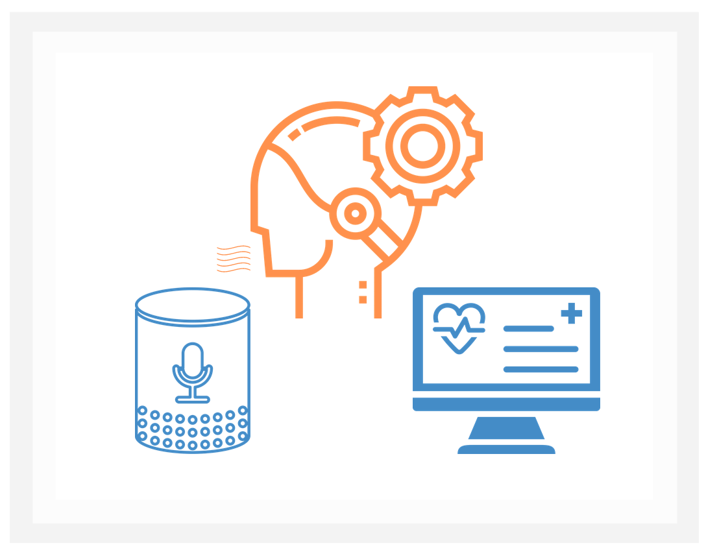

##  __India AI Guild__

We are the confluence of AI and data science enthusiasts in India. We are excited about solving the many challenges that health care poses using machine learning, statistics, and computer science. As we work in our respective areas, we realize that to become proficient AI researchers and data scientists we rely on the expertise of fellow AI enthusiasts. Our common goal is to build a thriving community of members that love solving these business challenges through collaboration, are hands-on and keen to strengthen the AI network in all possible forms. Our members love to support each other in resolving technical issues, sharing experiences/best practices, providing feedback and mentorship. We actively engage in discussions on state-of-the-art research papers by way of paper reading, commentary, and code reviews. We also organize virtual or in-person meet ups that allow us to network and identify new opportunities to learn.

:::note JOIN THE GLOBAL AI COMMUNITY
Please register [**here**][rs] to be a part of AI for All.
:::

 

 

 

##  __Upcoming Events__

 

:::note Coming Soon 

Join the [**IndiaAI Guild Channel**] [et] on team to stay updated on upcoming courses.

:::

| Course Name   | Training Type |   Date    |  Trainer Name        | Registration |
| --------------| ------------- | --------- |  --------------------|--------------| 
 Hands-on AWS workshops on ML  |  Workshop |  12th to 17th August, 2021 | Amazon Trainers | [**Link for Registration**] [link]
 Quantum Computing  |  Speaker Series |  19th August, 2021 | Versaggi, Matthew R  | [**Link for Registration**] [et]
  MLOps |  Speaker Series |  24th august, 2021 | Karthik | [**Link for Registration**] [et]
 
 

##  __Training Calender__

| Month | Course Name | Topics Covered | Training Type | Registration | Target Audience | Duration | Tentative Date|
| ------ | --------- | -------------- | ------------- |--------------|-----------------|----------| --------------|
July,  2021 |Introduction to Adversarial AI|Human-cantered AI taking into account human and socio-centric considerations as well as ethically sound AI deployments.|Speaker Series|Beginners|1 Hour|Dominik Daheim| 7 July,2021|
July,  2021 |Azure Cognitive Services - Text Analytics|Overview of text analytics and use cases in healthcare. Breakout by Microsoft. Lab Sessions|Workshop|Intermediate|2 Hour|Sanjay S, Pankaj Khatter| 12 July,2021|
July,  2021 |Azure Cognitive Services - Speech and Vision|Overview of Speech and use cases in healthcare. Breakout by Microsoft. Lab Sessions|Workshop|Intermediate|2 Hour|Sanjay S, Pankaj Khatter| 13 July,2021|
July,  2021 | Azure Cognitive Services - Intro and Demo|Cognitive Services Details|Workshop|Intermediate|1.5 Hours|Sanjay S, Pankaj Khatter| 14 July,2021|
July,  2021 | Imageing and Analytics| NA |Speaker Series|Beginners|1 Hour|Rama Krishna Sigh (Sr Dr Analytics)| 21 July,2021|
July,  2021 | AI Overview - Role of AI in the Future of Work  (Phillpiines Audience)|AI Fundamentals and Use cases|Speaker Series|Beginners|1 Hour|Alok and Mansi| 28 July,2021|
August,  2021 | Azure Cognitive Services - Text Analytics|Overview of text analytics and use cases in healthcare. Breakout by Microsoft. Lab Sessions|Workshop|Intermediate|2 Hour|Sanjay S, Pankaj Khatter| 2 August,2021|
August,  2021 | Azure Cognitive Services - Speech and Vision|Overview of Speech and use cases in healthcare. Breakout by Microsoft. Lab Sessions|Workshop|Intermediate|2 Hour|Sanjay S, Pankaj Khatter| 3 August,2021|
August,  2021 | Azure Cognitive Services - Intro and Demo|Cognitive Services Details|Workshop|Intermediate|1.5 Hour|Sanjay S, Pankaj Khatter| 4 August,2021|
August,  2021 | AI Foundation for Full Stack Engineer (FSE)|AI/ML Fundamentals, ML Life cycle;AI/ML Optum Use Cases and implementation details|Speaker Series|Intermediate|1.5 Hour|Karthik, Amit Goswami| 9 August,2021|
August,  2021 | Quantum Computing|Introduction to Quantum Computing and Use Cases|Speaker Series|Intermediate|1.5 Hour|Matthew R Versaggi| 19 August,2021|
August,  2021 | Cognitive Technology|Introduction to Quantum Computing and Use Cases|Speaker Series|Intermediate|1.5 Hour|Matthew R Versaggi| 26 August,2021|
September,  2021 | Artifical Neural Network|Introduction to ANN; Deep Learning; Neural Network Architecture; Backpropagation etc|Workshop|Intermediate|2 Hours|TBD| Coming in September|
September,  2021 | Image Processing using CNN  (Tensorflow)|Introduction to CNN;convolutions and pooling; Designing a CNN network and understanding the layers params;Hands-on Real world Images data.|Workshop|Advance|2 Hours|TBD| Coming in September|
September,  2021 | Speaker Series -01| NA|Speaker Series|Intermediate|1.5 Hours|TBD| 3 September,2021|
September,  2021 | MLOps - Machine Learning Ops|MlOps - Life Cycle and Challenges|Speaker Series|Intermediate |1.5 Hours|Madhuri & Amit G| 9 September,2021|
September,  2021 | Speaker Series -02| NA|Speaker Series|Intermediate|1.5 Hours|TBD| 17 September,2021|
September,  2021 | Recurrent Neural Networks |Introducing RNNs ;Long Short-Term Memory (LSTM) in Tensorflow|Workshop|Advance|2 Hours|TBD| Coming in September|
September,  2021 | Natural Language Processing/ Text Based Model Modelling |Text processing elements; RNN and Long Short Term Memory networks for NLP Model Predcition;Hand-on NLP Models|Speaker Series|Intermediate|2 Hours|TBD| Coming in September|

##  __Github Organization__

Check out our repos on our [**GitHub Organization**][gh] to dig into the code!

##  __How to Get Involved__

- Please join the [**IndiaAI guild channel**] [et] on teams
- Come to our meetings and engage with the community
- Present a topic you found interesting or a project that you're working on
- Participate in the next data science challenge
- Help plan our next event!

##  __Contact Us__

Use any of the links below to get in touch with us! 
- [**AI for ALL**] [rs]  to be in sync with the global events 
- [**IndiaAI guild**] [et] to get in touch with the local events

<!-- Links -->
[gh]: https://github.optum.com/IndiaDSAIGuild
[rs]: https://teams.microsoft.com/l/channel/19%3acaa60c3a0b83449b891732b0ad5ae22b%40thread.tacv2/General?groupId=a886ded2-d2cb-437c-acbf-e9d200fd8480&tenantId=db05faca-c82a-4b9d-b9c5-0f64b6755421
[et]: https://teams.microsoft.com/l/channel/19%3a325932431eb94cd6b0bd28b9b5347e16%40thread.tacv2/General?groupId=0a0c622c-fb37-48fd-9dd5-866ae670e5a6&tenantId=db05faca-c82a-4b9d-b9c5-0f64b6755421
[link]: https://pages.awscloud.com/aws-techace-workshop.html?trk=em_inv3_cta1

						
 

 
