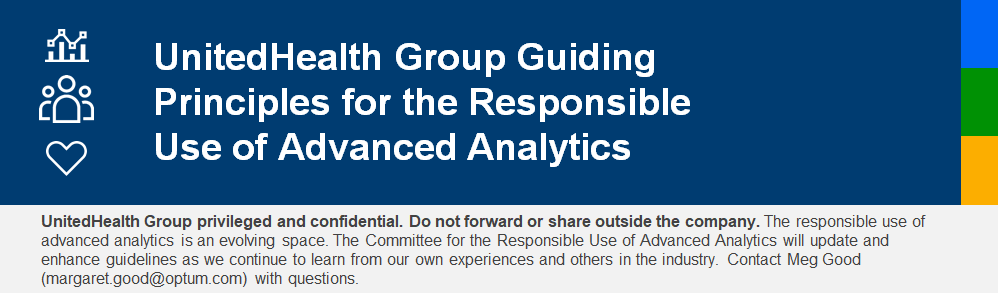

UnitedHealth Group and its subsidiaries around the globe (“UnitedHealth Group” or the “enterprise”) are committed to using advanced analytic solutions to help drive our mission to help people live healthier lives and help make the health system work better for everyone.  To meet the needs of those we serve, we must ensure that any algorithmic solutions, including artificial intelligence, augmented intelligence, automated decision-making, data analytics, and machine learning (collectively “advanced analytic solutions”), are developed and deployed ethically, responsibly, and in accordance with our mission.  While advanced analytic solutions bring substantial benefits, they can have unintended consequences that are difficult to anticipate, identify, or measure. The following principles serve as guideposts for the enterprise and should be considered in connection with the development and deployment of advanced analytic solutions internally and in the marketplace. 

## __Mission-Driven.__

Our advanced analytic solutions will be developed and deployed in a manner consistent with our enterprise mission of helping people live healthier lives and helping make the health system work better for everyone.

## __Trust.__

UnitedHealth Group will earn and preserve trust through truthfulness, integrity, active engagement, and collaboration with our customers, consumers, and the communities where we live and work. It is critical that users of enterprise advanced analytic solutions trust the solutions to reliably execute their intended function or task.  Advanced analytic solutions should support patient health and the efficiency of the health system and should neither cause nor exacerbate harm. 

## __Fairness.__

UnitedHealth Group will avoid introducing or intensifying existing health disparities when using advanced analytic solutions.  We will proactively assess performance of our advanced analytic solutions for potential bias and disparate impact on vulnerable groups and those who may be at risk of exclusion from the health system.

## __Accountability.__

UnitedHealth Group will assess advanced analytic solutions, with consideration of the end user experience, to improve the dependability of the solutions and promote confidence in their use. We will hold ourselves accountable for our advanced analytic solutions and be prepared to react swiftly to address and correct any misuse or unforeseen adverse outcomes.

## __Transparency.__

UnitedHealth Group understands that fairness and accountability depend upon transparency, and we will ensure that where advanced analytic solutions are used for automated decisions that affect individuals or their care, we will have the ability to review the data and model outputs involved in those decisions.

## __Privacy.__

UnitedHealth Group will safeguard personal privacy interests in the design, deployment, and use of all advanced analytic solutions.  We will incorporate our organization’s rigorous, longstanding privacy practices, and ensure the solutions are consistent with applicable legal and policy standards. 

:::note

Guiding principles were developed by the Committee for the Responsible Use of Advanced Analytics, which comprises attendees across Optum, UnitedHealthcare and UnitedHealth Group, and includes analytics and legal experts. Principles were developed based on a review of scientific, industry and legal literature; as well as input from internal and external subject matter experts, and are subject to evolve as needed.

UnitedHealth Group recognizes that tension may arise among these Principles as advanced analytic solutions continue to evolve.  It is important that we continuously assess, document and develop resolutions consistent with our mission and values.  Contact [**Meg Good**](mailto:margaret.good@optum.com) if questions arise about these principles.

:::

